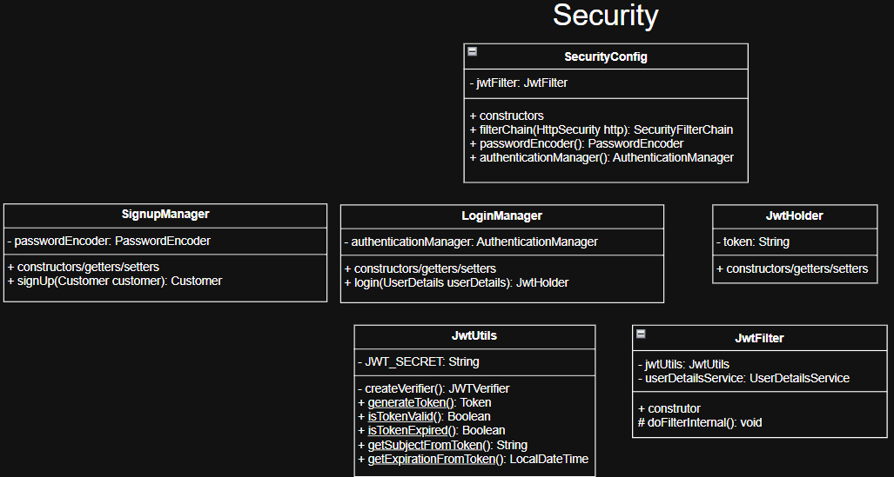
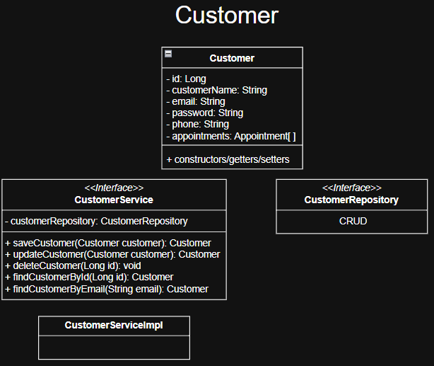
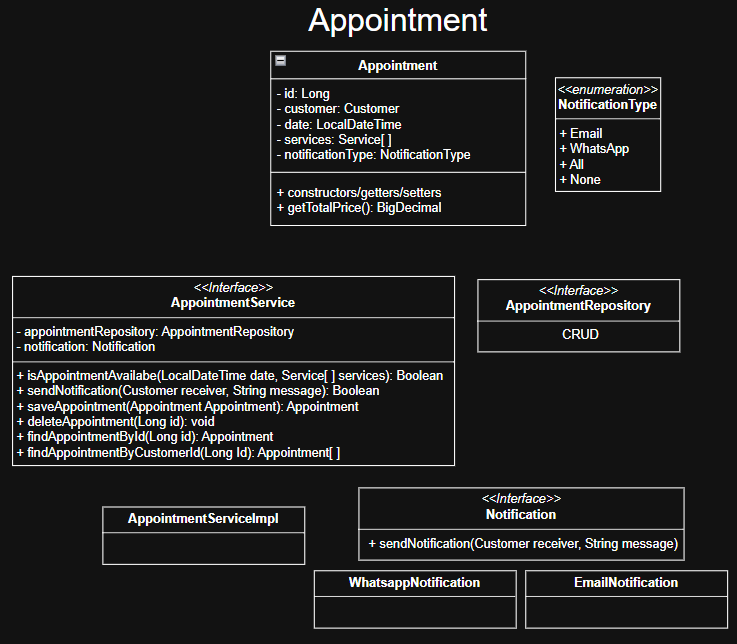
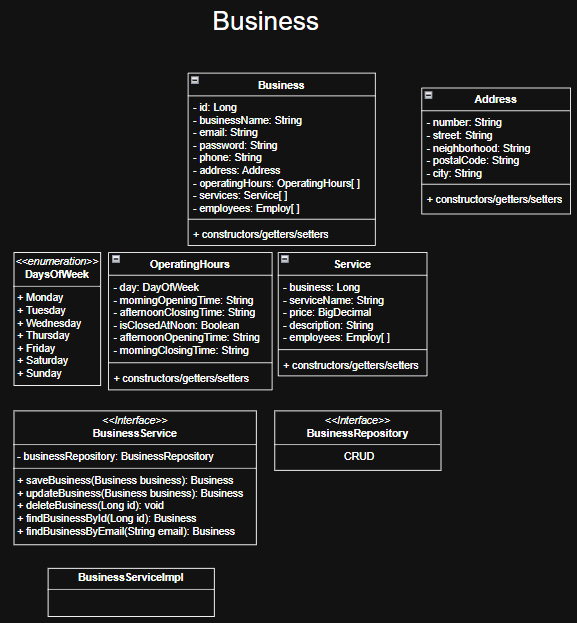

# BarberFlow

## Objetivo
O BarberFlow é uma tentativa de criar o back-end de uma aplicação Web que fará o gerenciamento de agendamentos em barbearias e salões de beleza no geral.

## Funcionalidades
Como o projeto está em seu estágio inicial, serão adicionadas apenas algumas funcionalidades inicialmente. Mais delas serão inseridas com o passar do tempo. No momento, será implementado:

1. Cadastro e login de clientes e empresas.
2. Agendamento de serviços por parte do cliente e possibilidade de cancelamento.
3. Disponibilização de serviços por parte das empresas.
4. Envio de notificações para o cliente.

    4.1. A princípio, serão suportadas notificações por e-mail e Whatsapp.

5. Acesso ao histórico de serviços realizados pelo cliente.

## Tecnologias
Como citado, devido a sua fase inicial, o projeto não possui todas as tecnologias que viso utilizar. Nesse momento, estão sendo utilizas:

1. Spring Web
2. Spring Data Jpa
3. Spring Security
4. Lombok
5. Docker
6. Postgres

    6.1. O Postgres está rodando como um container docker.

7. Jwt
## Futuro
Futuramente busco amplicar o leque de funcionalidades e tecnologias. Alguns exemplos que serão adicionados de:

    Funcionalidades:
        1. Suporte a upload de imagens.
        2. Agendamento como visitante, não precisando realizar cadastro.
        3. Possibilidade de cadastro por meio de rede sociais ou gmail.
        4. Pagamentos pela aplicação.
        5. Caching
    
    Tecnologias:
        1. OAuth 2.0
        2. Mockito
        3. Redis
 
## Arquitetura
Seguindo o padrão arquitetural DDD, por isso, a aplicação foi dividida em quatro subdomínios: Security, Customer, Appointment e Business. Cada um deles sendo responsável, respectivamente, por lidar com a segurança, os clientes, os agendamentos e as empresas.
Fiz um esboço básico com algumas classes para exemplificar a ideia e organizar o projeto.

### Security

### Customer

### Appointment

### Business

## Controle de qualidade
Para assegurar ao máximo o controle de qualidade da aplicação, haverão branches para cada nova funcionalidade implementada. Só será feito o merge com a branch principal quando houver um cobrimento de testes aceitável. A maioria dos testes serão unitários, haverá alguns de integração e não tenho certeza se teremos algum E2E (talvez com Postman).